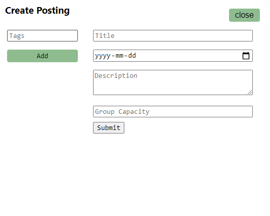
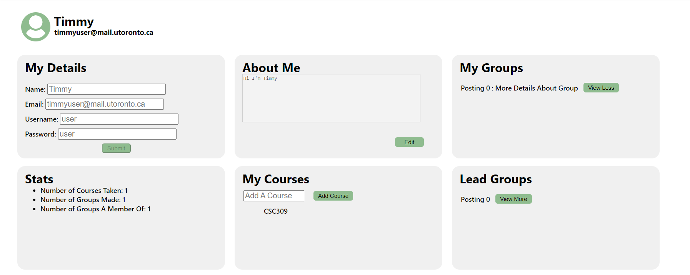
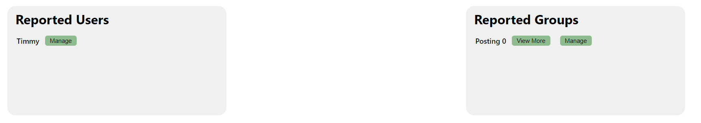
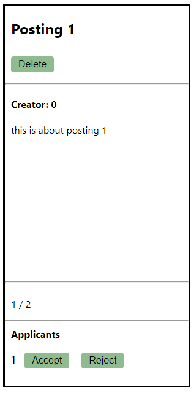

# team59

## Setup
To run a local version, navigate to the `sprint1/connect-uoft-frontend` folder 
in your terminal and run `npm install` then `npm start` (if you are using npm as a package manager)

## Usage Instructions:

### Login
please note that you will stay logged in as a user until you decide to logout (logout in profile page)

regular user credentials:
* username: user
* password: user

admin user credentials: 
* username: admin
* password: admin

### Logout
To logout you must navigate to localhost:3000/logout
* From there you will be able to click the logout button to log out, 
  then click another button to navigate to the login page
* Due to no backend this our temporary work-around to logging out

### Signup
Click on "create account" on the bottom left of the login box to navigate to the signup page \
Since we are not connected to a backend, signing up for a new user will only work if you do not refresh the page 
and reset the state \

### Navigation
After logging in, you may use the header to navigate the website
* Click on the "ConnectUofT" on the left side to navigate to the home page
* Click the "Manage" button to navigate to the page to manage postings
* Click the "Create" button to bring up a popup to create a new post
* Click the rightmost green profile icon button to navigate to the user profile page

### Search for Posts
On the homepage, the left section can be used to search for posts. 
* You may add tags to search for in the input box
    * press the "Add Tag" button to add a tag once you are done typing
    * If you already added a certain tag, you are not allowed to add a duplicate
* If you want to delete a tag, click the white "x" on the right of the tag to remove it 
  from the list of tags to search for 
Once you are done, you may press the "Search" button to display a list of postings that contain the matching tags
  

### Create Posts
In the header, you will find a "Create+" button for creating posts.
Clicking this button will prompt the user for information to create a new post
* You must enter a title for the posting in the first input box
* You must enter a date into the second input box
  * The date will be the end-date of the posting
* You must enter a description into the text area
* You must enter a capacity for the posting in the last input box
* You may add tags to your posting  in the input box to the left
    * press the "Add Tag" button to add a tag once you are done typing
    * If you already added a certain tag, you are not allowed to add a duplicate
* You may click close at the top right to cancel the posting creation
Once you are done, click submit to create a posting with the information provided

### View/Edit Profile
Depending on who is logged in, a profile page will be shown to the user.
By clicking on the rightmost green profile button icon on the header,
you are sent a profile page

Regular User and Admin

* For 'My Details': You are presented a form to change name, username, password and email
* For 'About Me': You are able to view your old bio and change it in the text area
* For 'My Courses': You are able to view and add courses that you are taking/teaching
* For 'Stats': You are able to view your statistics such as groups made/a member of
* For 'My Groups': You are able to view all your groups and view details
* For 'Lead Groups': You are able to view all your made groups and view details

Admin Added

* For 'Reported Groups': You as an admin are able to view reported groups and manage them
* For 'Reported Users': You as an admin are able to view reported users and manage them

### Manage Posts
On this page you may find postings that you are a creator of
* You will see a delete button on the postings you are creator of
* You will see a list of applicants to your posting
  * You may accept or reject an applicant

## External Libraries Used:
* `react` and its dependencies
* `react-router-dom`

## Additional Notes:
icons used from https://iconmonstr.com/
