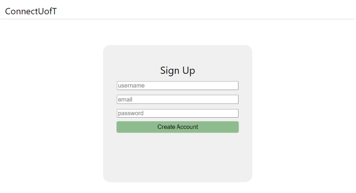

# team59

## Setup
To run a local version, navigate to the `sprint1/connect-uoft-frontend` folder 
in your terminal and run `npm install` then `npm start` (if you are using npm as a package manager)

## Usage Instructions:

### Login
please note that you will stay logged in as a user until you decide to logout (logout in profile page)

regular user credentials:
* username: user
* password: user

admin user credentials: 
* username: admin
* password: admin

### Signup
Click on "create account" on the bottom left of the login box to navigate to the signup page \
Since we are not connected to a backend, signing up for a new user will only work if you do not refresh the page 
and reset the state \

### Navigation
After logging in, you may use the header to navigate the website
* Click on the "ConnectUofT" on the left side to navigate to the home page
* Click the "Manage" button to navigate to the page to manage postings
* Click the "Create" button to bring up a popup to create a new post
* Click the rightmost green profile icon button to navigate to the user profile page

### Search for Posts
On the homepage, the left section can be used to search for posts. 
* You may add tags to search for in the input box
    * press the "Add Tag" button to add a tag once you are done typing
    * If you already added a certain tag, you are not allowed to add a duplicate
* If you want to delete a tag, click the white "x" on the right of the tag to remove it 
  from the list of tags to search for 
Once you are done, you may press the "Search" button to display a list of postings that contain the matching tags
  

### Create Posts

### View/Edit Profile

### Manage Posts

## External Libraries Used:
* `react` and its dependencies
* `react-router-dom`

## Additional Notes:
icons used from https://iconmonstr.com/