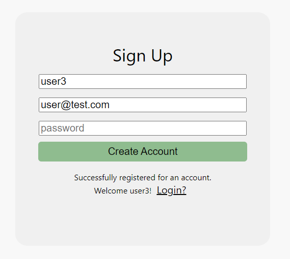

# team59

## ConnectUofT Link
https://connectuoft.herokuapp.com
## Who this is for?
ConnectUofT's mission is to give students attending UofT the ability to create and join groups to meet new people and organize study sessions.
## User Interactions
Regular User 
 * Login, Logout, Signup
 * Create, Edit, Delete their own posts
 * Apply and Join Groups
  * Leave a comment on the group posting
 * Edit Profile
 * View Profile
 * View Joined and Made groups
 * Search for groups to join based on tags
 * View all groups where their status is pending
 * View all groups where their status is denied

Admin User
 * View reported users
 * View reported postings
 * Delete any reported user 
 * Delete any posting 
 * Unreport any user
 * Unreport any posting
 
Any user using the link for the first time will be presented with the Login Screen

### Login
Please note that you will stay logged in as a user until you decide to logout (logout in profile page) or until the session expires (1 hour)
Here are some mock credentials that you are already loaded in the database
MOCK-DATA credentials:
- Regular-User-1:
  * username: user
  * password: user

- Regular-User-2
  * username: user1
  * password: user1

- Admin-User-1: 
* username: admin
* password: admin

### Logout
To logout the user must navigate to your profile page and click on the "Logout" button located
at the top-right of the page under the header
* Logging out terminates the session and brings the user back to the login screen

### Signup
Click on "create account" on the bottom right of the login box to navigate to the signup page \
The username field can be whatever they like, however the email field has a validator associated with it.
The password field must not be less than 4 characters.
If a user successfully fills in the fields, a new user is created (if username is not already taken).
The user is then prompted to return to the login page

    

### Navigation
After logging in, you may use the header to navigate the website
* Click on the "ConnectUofT" on the left side to navigate to the home page
* Click the "Manage" button to navigate to the page to manage postings
* Click the "Create" button to bring up a popup to create a new post
* Click the rightmost green profile icon button to navigate to the user profile page

### Search for Posts
On the homepage, the left section can be used to search for posts. 
* You may add tags to search for in the input box
    * press the "Add Tag" button to add a tag once you are done typing
    * If you already added a certain tag, you are not allowed to add a duplicate
* If you want to delete a tag, click the white "x" on the right of the tag to remove it 
  from the list of tags to search for 
Once you are done, you may press the "Search" button that will filter all the current postings with the tags selected
Posts a user has created themselves and reported posts are excluded from search results.
  

### Create Posts
In the header, you will find a "Create+" button for creating posts.
Clicking this button will prompt the user for information to create a new post
* You must enter a title for the posting in the first input box
* You must enter a date into the second input box
  * The date will be the end-date of the posting
* You must enter a description into the text area
* You must enter a capacity for the posting in the last input box
* You may add tags to your posting  in the input box to the left
    * press the "Add Tag" button to add a tag once you are done typing
    * If you already added a certain tag, you are not allowed to add a duplicate
* You may click close at the top right to cancel the posting creation
Once you are done, click submit to create a posting with the information provided
(you may see the new posting object in the console but the UI will update when we connect with a backend)

### View Profile - Logged In User
Depending on who is logged in, a profile page will be shown to the user.
By clicking on the rightmost green profile button icon on the header,
you are sent a profile page.
This view was changed to separate editing a profile from viewing the profile

- Regular User and Admin
 
  * For 'About Me': The user is able to view their bio
  * For 'My Courses': You are able to viewcourses that you are taking/teaching
  * For 'Stats': You are able to view your statistics such as groups made/a member of
  

  * For 'My Groups': You are able to view all your groups and view details about that group/post
    * Clicking on the post will take the user to a post card view that isolates the post
    * Clicking on the different members will take the user to a user profile view that showcases the selected user
  * For 'Lead Groups': You are able to view all your made groups and view details
     * Clicking on the post will take the user to a post card view that isolates the post
     * Clicking on the different members will take the user to a user profile view that showcases the selected user
- Admin Additions
  * On the admin profile page 

* For 'Reported Groups': You as an admin are able to view reported groups and manage them
* For 'Reported Users': You as an admin are able to view reported users and manage them

### Edit Profile
We have added the ability for a user to change several attributes in one focused element.

A user can change their profile picture, name, email, username, password, bio and the courses that they are taking.
To be specific a user can not add more than 6 courses currently 3.00 credit limit.

### View Profile - Other User
We have added a feature to view other user's profile.

Here the currently logged in user can view another user's profile.
The information includes, user profile picture, name, username, reporting status,
bio and courses.

### Manage Posts
To access manage postings the user must click on "Manage"
On this page the user will be able to view all of the postings they are associated with
* The user can filter postings by the ones they have created, that they are a member of, that they have applied to and the postings that they were denied
* Each posting has been given a comment section where all users can communicate and share information
* User created postings allow the user to see a list of applicants to their posting
  * Each applicant has an associated accept or reject button that the creator can click
* User created postings also have the option to go into edit mode where the user can edit all fields associated with post as well as delete the post.

## External Libraries Used:
* `react` and its dependencies
* `react-router-dom`

## Additional Notes:
icons used from https://iconmonstr.com/
